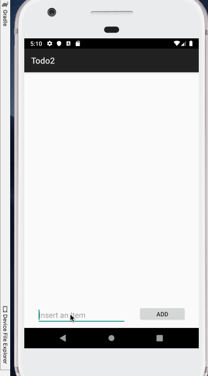

# Project 1 - *TodoApp*

TodoApp is an android app that allows building a todo list and basic todo items management functionality including adding new items, editing and deleting an existing item.

Submitted by: Pablo Moreno

Time spent: 4 hours spent in total

## User Stories

* [1] User can view a list of todo items
* [2] User can successfully add and remove items from the todo list
* [3] User's list of items persisted upon modification and and retrieved properly on app restart

## Video Walkthrough

Here's a walkthrough of implemented user stories:

GIF created with [LiceCap](http://www.cockos.com/licecap/).

